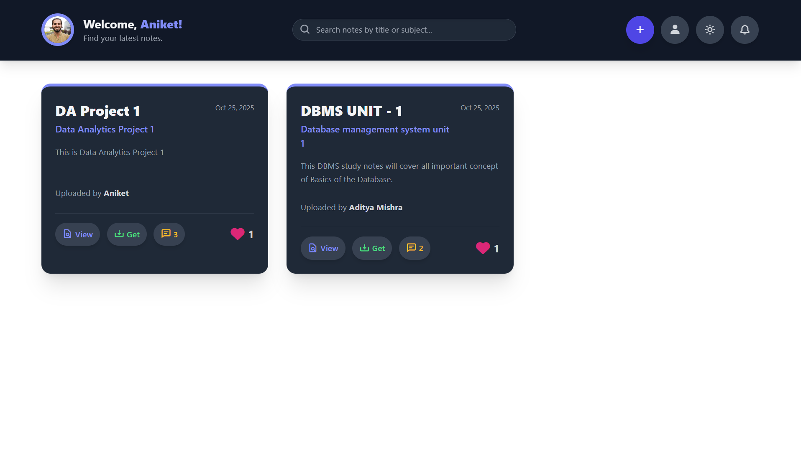

# 📚 Share Study Material - Online Notes Sharing Platform

A robust web application designed for students and educators to **share, view, and download study notes** efficiently. It integrates essential community features like **user authentication, likes, comments, and real-time notifications**.

---

## ✨ Key Features

* **Secure User Authentication:** Complete sign-up, login, and profile management system.
* **Easy Note Upload:** Users can upload **PDF, DOC, and DOCX** files, categorized by title, subject, and a detailed description.
* **Browse & Download:** Intuitive dashboard to view notes, with powerful search functionality. Notes can be viewed online or downloaded directly.
* **Community Interaction:** Engage with content through **likes and a comment system**.
* **Real-time Notifications:** Instant alerts for new likes and comments on user-uploaded material (indicated by a red dot on the bell icon).
* **Ergonomic Dark Mode:** A toggle feature for light and dark themes to enhance readability.

---

## 🖼 Screenshots

| Dashboard | Upload Notes |
| :---: | :---: |
|  |  |

| Note Details | Notifications |
| :---: | :---: |
|  |  |

---

## ⚙️ Installation and Setup

### Prerequisites

You will need a local server environment (like **XAMPP** or **WAMP**) that supports **PHP** and **MySQL**.

### Steps

1.  **Clone the Repository:**
    ```bash
    git clone [https://github.com/adityamishras/Share_Study_Material.git](https://github.com/adityamishras/Share_Study_Material.git)
    cd Share_Study_Material
    ```

2.  **Server Setup:**
    Move the `Share_Study_Material` directory into your local server's web root (e.g., `C:\xampp\htdocs\`).

3.  **Database Configuration:**
    * Open **phpMyAdmin** in your browser.
    * Create a new database named `share_notes`.
    * Import the provided SQL file: `database.sql` into the newly created `share_notes` database.

4.  **Update Connection File:**
    Edit the database connection details in `includes/db.php`:

    ```php
    <?php
    $servername = "localhost";
    $username = "root"; // Your MySQL username
    $password = "";    // Your MySQL password
    $dbname = "share_notes";

    $conn = new mysqli($servername, $username, $password, $dbname);

    if ($conn->connect_error) {
        die("Connection failed: " . $conn->connect_error);
    }
    ?>
    ```

5.  **Run the Application:**
    Access the application in your web browser:
    ```
    http://localhost/Share_Study_Material/
    ```

---

## 🛠 Tech Stack

| Type | Technologies Used |
| :--- | :--- |
| **Frontend** | HTML5, CSS3, **JavaScript**, **Tailwind CSS**, Boxicons |
| **Backend** | **PHP** (Server-side scripting), **MySQL** (Database) |
| **Dynamics** | **AJAX** (For dynamic updates of likes, comments, and notifications) |

---

## 🚀 Usage Guide

1.  **Start:** Navigate to the index page to **Register / Login**.
2.  **Contribute:** Use the upload feature to share your notes with a title, subject, and description.
3.  **Explore:** Browse the dashboard and use the search bar to find material by keywords.
4.  **Engage:** Interact with notes using the **Like / Comment** system.
5.  **Stay Updated:** Check the bell icon for notifications when others interact with your uploads.

---

## 📝 Notes

* **Allowed Note Types:** `.pdf`, `.doc`, `.docx`.
* **Allowed Photo Types:** `.jpg`, `.jpeg`, `.png`, `.webp` (for user profiles).

---
